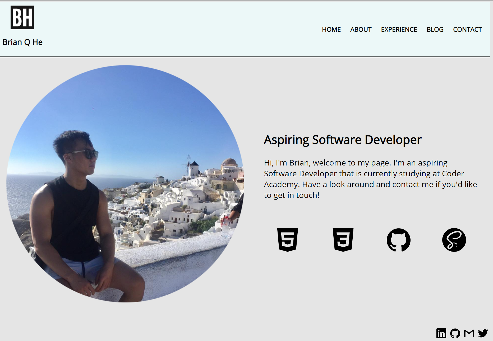
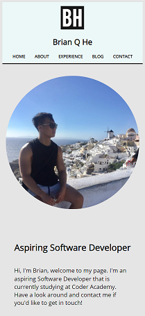

# README

## General
---

The link (URL) to the site is [https://brianqhe.netlify.app/](https://brianqhe.netlify.app/)

The link to the associated Github respository is [https://github.com/brianqhe/portfolio-website](https://github.com/brianqhe/portfolio-website)

## Purpose
---

The purpose of this website to communicate and demonstrate my abilities to prospective employers.

To showcase my abilities, this website was created to showcase my talent, abilities and coding experience. This website will provide information about myself, my skills, interest, professional knoweldge and a showcase of my work.

## Functionality / Features
---

The functionality and features of the webiste are as follows - 

- The website has a fully functioning navigational bar, allowing users to navigate to other pages within the website with ease. 

- The header of the website also has the website's logo, which can also be used to navigate to the homepage.

- There is a feature in the Experience page whereby viewers of the website can download a copy of my resume for their interest.

- Within the Contact page, there are links to all my social media pages with their corresponding icons which can be activated it clicked onto

- The website is designed to be fully functional and adapted for mobile and tablet usage

## Sitemap
---

Sitemap is as follows -

## Screenshots
---

The site is designed to be a responsive design to different devices.

An example of this is through the home screen of the desktop and mobile view respectively - 

## Target Audience
---

The target audience for the portfolio website is an employer looking to engage a dev and/or IT professional. Upon visiting my website, the employer is ecpected to understand my technical knowledge relating to information technology, software development/coding, programming languages and development stacks 

## Tech Stack
---

The technology utilised in the creation of this website is HTML5, CSS3, SASS as well as Subresource Integrity (SRI). 

- HTML5 was used as the markup language for the website

- CSS3 was used as the stylesheet for the styles in the website

- SASS was used as the preprocessor to compile the CSS stylesheet

- SRI was used to enhance the security of the stylesheet

- Netlify was used as the deployment platform, a free third party deployment web application.