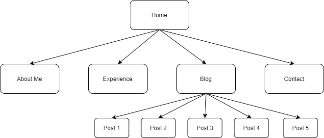
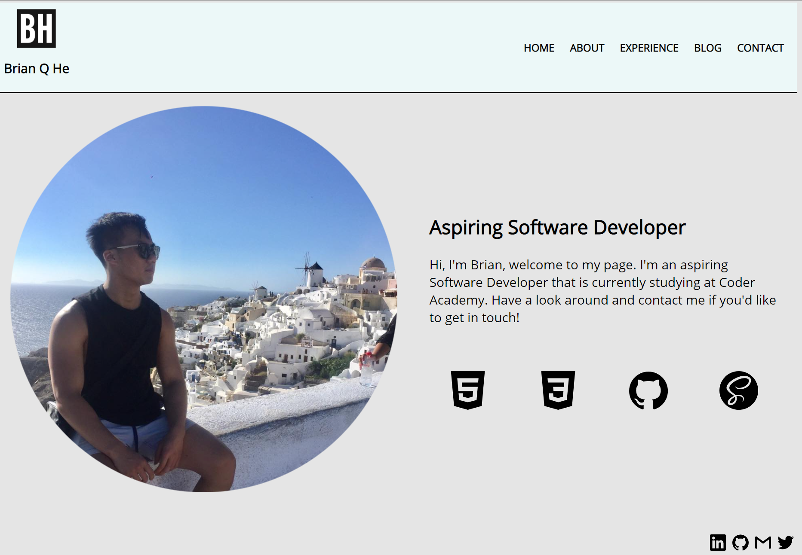
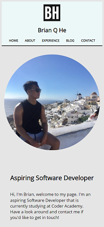

# README

## General
---

The link (URL) to the site is [https://brianqhe.netlify.app/](https://brianqhe.netlify.app/)

The link to the associated Github respository is [https://github.com/brianqhe/portfolio-website](https://github.com/brianqhe/portfolio-website)

## Purpose
---

The purpose of this website to communicate and demonstrate my abilities to prospective employers.

This website was created to showcase my talent, abilities and coding experience. This website will provide information about myself, my skills, interest, professional knoweldge and a showcase of my work.

The website will also show prospective employers the tech stacks that I am familiar with and links to my social media accounts to contact me.

## Functionality / Features
---

The functionality and features of the webiste are as follows - 

- The website has a fully functioning navigational bar, allowing users to navigate to other pages within the website with ease. 

- The header of the website also has the website's logo, which can also be used to navigate to the homepage.

- There is a feature in the Experience page whereby viewers of the website can download a copy of my resume for their interest. This resume will appear in a new tab in their browser when clicked.

- Within the Contact page, there are links to all my social media pages with their corresponding icons which can be activated it clicked onto.

- The website is designed to be fully functional and adapted for mobile, tablet and desktop usage.

- The About page has a series of images with text overlay that displays the personal interests and hobbies of myself, allowing the website visitor to see more into my personality.

- The website has a Blog page, which has a series of blog post previews. Each preview is accessible through the Read More button or through clicking on the title of the blog preview.

## Sitemap
---

The sitemap of this website is as follows -

It should be noted that from each branch from the home page, it is possible for the user to navigate between each page with the navigation bar or home logo icon in the top left corner of the site.

## Screenshots
---

The site is designed to be a responsive design to different devices.

To create responsive design, Wireframes were created using Balsamiq to understand the general layout of each page. For reference, please see below screenshots of the Home Page in Balsamiq - 

**Desktop Version**

**Mobile Version**

**Tablet Version**

An example of this is through the home screen of the desktop and mobile view respectively - 

## Target Audience
---

The target audience for the portfolio website is an employer looking to engage a dev and/or IT professional. Upon visiting my website, the employer is expected to understand my technical knowledge relating to information technology, software development/coding, programming languages and development stacks.

## Tech Stack
---

The technology utilised in the creation of this website is HTML5, CSS3, SASS as well as Subresource Integrity (SRI). 

- HTML5 was used as the markup language for the website

- CSS3 was used as the stylesheet for the styles in the website

- SASS was used as the preprocessor to compile the CSS stylesheet

- SRI was used to enhance the security of the stylesheet

- Netlify was used as the deployment platform, a free third party deployment web application.

- Balsamiq was used at the Wireframe creation tool for the design and repsonsive design tool